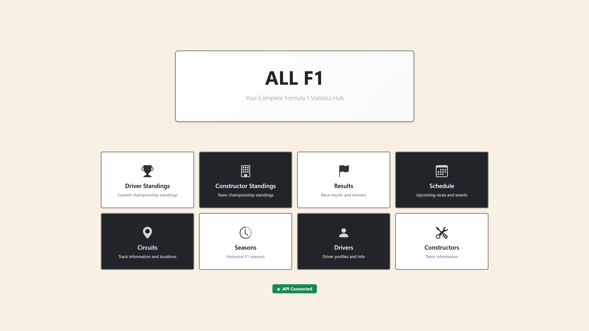
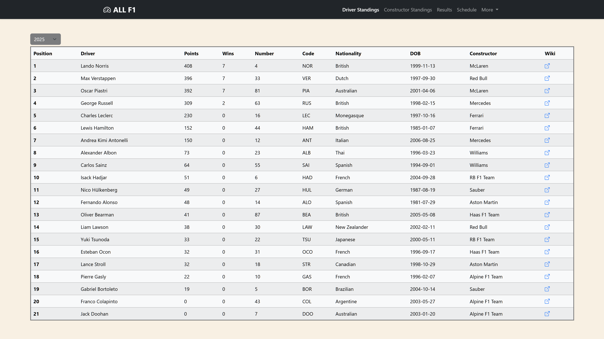
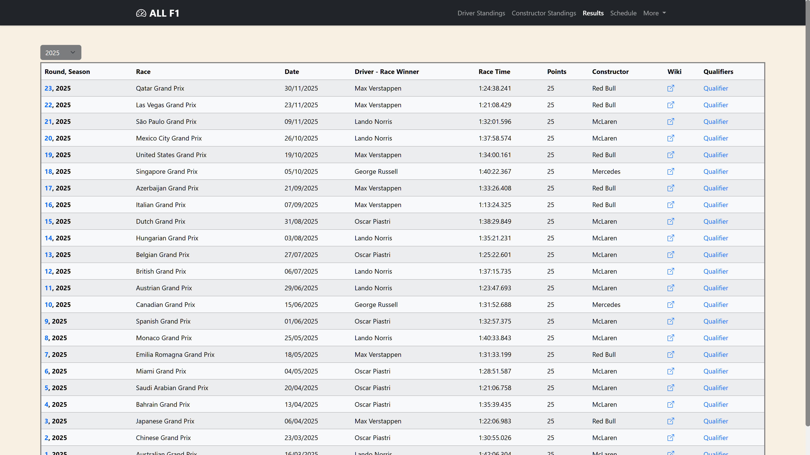
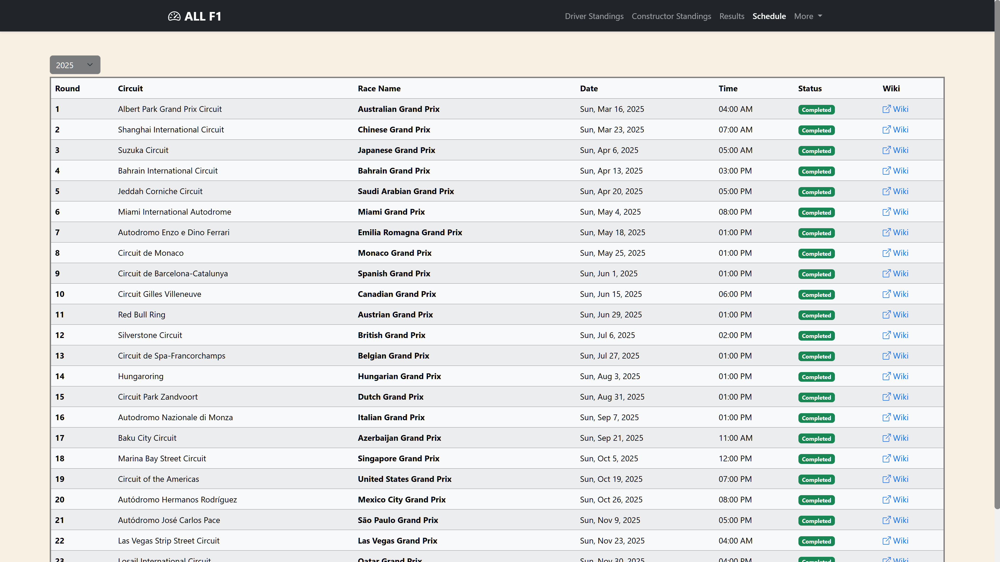

# ALL F1 - Formula 1 Statistics Hub

A modern, responsive web application providing comprehensive Formula 1 statistics, standings, race results, and schedules from 1950 to present.


## Screenshots

| Home | Driver Standings |
|------|------------------|
|  |  |

| Race Results | Schedule |
|--------------|----------|
|  |  |

## Features

- **Driver Standings** - Championship points, wins, and constructor affiliations
- **Constructor Standings** - Team championship rankings and statistics
- **Race Results** - Complete race classifications with position changes and lap times
- **Qualifying Results** - Q1/Q2/Q3 session times with elimination highlighting
- **Race Schedule** - Full season calendar with "next race" indicators and completion status
- **Historical Data** - Access to every F1 season from 1950 onwards
- **Responsive Design** - Optimised for desktop, tablet, and mobile devices

## Tech Stack

- **Framework:** Vue.js 3 with Composition API
- **State Management:** Vuex 4
- **Routing:** Vue Router 4
- **HTTP Client:** Axios with request cancellation
- **Styling:** Bootstrap 5, SCSS, Bootstrap Icons
- **Build Tool:** Vue CLI

## Getting Started

### Prerequisites

- Node.js 16.x or higher
- npm or yarn

### Installation

```bash
# Clone the repository
git clone https://github.com/yourusername/all-f1-frontend.git
cd all-f1-frontend

# Install dependencies
npm install

# Start development server
npm run serve
```

The application will be available at `http://localhost:8080`

### Environment Configuration

Create environment files for different environments:

**.env.development**
```
VUE_APP_API_URL=http://localhost:8000
VUE_APP_ENV=development
```

**.env.production**
```
VUE_APP_API_URL=https://your-backend-url.com
VUE_APP_ENV=production
```

### Available Scripts

| Command | Description |
|---------|-------------|
| `npm run serve` | Start development server with hot-reload |
| `npm run build` | Build for production |
| `npm run lint` | Lint and fix files |
| `npm start` | Start production server (requires build) |

## Project Structure

```
src/
├── components/
│   ├── Dropdown.vue      # Year selector component
│   └── NavBar.vue        # Navigation bar
├── views/
│   ├── Home.vue          # Landing page with navigation cards
│   ├── DriverStandings.vue
│   ├── ConstructorStandings.vue
│   ├── Results.vue       # Season results overview
│   ├── RaceResults.vue   # Individual race results
│   ├── QualifyingResults.vue
│   ├── Schedule.vue
│   ├── Drivers.vue
│   ├── Constructors.vue
│   ├── Circuits.vue
│   ├── Seasons.vue
│   └── Error.vue         # 404 page
├── store/
│   └── index.js          # Vuex store configuration
├── router/
│   └── index.js          # Route definitions
├── utils/
│   ├── api.js            # API service with caching
│   └── debounce.js       # Utility functions
├── App.vue
└── main.js
```

## Key Features Explained

### Intelligent Loading States
The application uses a loading counter pattern that supports concurrent API requests without UI flickering. Global error handling displays user-friendly messages with auto-dismissal.

### Request Cancellation
When navigating between years rapidly, pending requests are automatically cancelled to prevent stale data from appearing.

### Smart Year Selection
The dropdown component generates years from 1950 to present and persists selection via route parameters, enabling direct linking to specific seasons.

### Visual Indicators
- Race schedule highlights the next upcoming race
- Position change arrows show gains/losses from grid position
- Qualifying times are colour-coded by elimination session
- API health status indicator on home page

## API Integration

The frontend connects to a Django REST Framework backend that proxies and caches data from the Jolpica F1 API. See the [backend repository](https://github.com/yourusername/all-f1-backend) for details.

## Deployment

### Render (Recommended)

The application includes a custom Express server (`server.js`) configured for SPA routing:

```bash
npm run build
npm start
```

### Docker

```dockerfile
FROM node:16-alpine
WORKDIR /app
COPY package*.json ./
RUN npm install
COPY . .
RUN npm run build
EXPOSE 3000
CMD ["npm", "start"]
```

## Browser Support

- Chrome (latest)
- Firefox (latest)
- Safari (latest)
- Edge (latest)

## Contributing

1. Fork the repository
2. Create a feature branch (`git checkout -b feature/amazing-feature`)
3. Commit your changes (`git commit -m 'Add amazing feature'`)
4. Push to the branch (`git push origin feature/amazing-feature`)
5. Open a Pull Request

## License

This project is licensed under the MIT License - see the [LICENSE](LICENSE) file for details.

## Acknowledgements

- [Jolpica API](https://github.com/jolpica/jolpica-f1) - F1 data provider (Ergast API mirror)
- [Bootstrap](https://getbootstrap.com/) - UI framework
- [Vue.js](https://vuejs.org/) - JavaScript framework